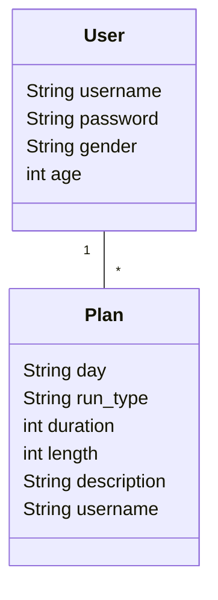

# Arkkitehtuuri

## Rakenne

Sovelluskoodi on kerrosarkkitehtuuriajattelua noudattaen jaettu pakkauksiin ui (käyttöliittymä), services (sovellustoiminnot), entities (luokat) ja repositories (tallennusratkaisut).

Käyttöliittymä luo instanssin sovelluksesta, joka puolestaan kutsuu varsinaisia entities-luokkia ja repositories-luokkia, jotka vastaavat tiedon tallennuksesta tietokantaan ja noutamisesta. 

## Käyttöliittymä - UI

Sovelluksessa on tekstipohjainen käyttöliittymä, joka on yhdessä luokassa [Ui](https://github.com/ah-pasila/ot-running-calendar/blob/master/src/ui/ui.py). Sovellus- ja käyttöliittymätoiminnot on pyritty pitämään erillään, Ui kutsuu RunCalendarService-luokkaa. 

Miinuksena rakenteen osalta se, että paljon syötteisiin liittyvää virhekäsittelyä jäi vain käyttöliittymän puolelle. Toisena isompana miinuksena maatimusmäärittelyssä tavoitteena oli toteuttaa graafinen käyttöliittymä, mikä on harmillinen puute. 

## Luokat User ja Plan sekä sovelluslogiikka RunCalendarService

Sovelluksessa on luokat [User](https://github.com/ah-pasila/ot-running-calendar/blob/master/src/entities/user.py) eli käyttäjä ja [Plan](https://github.com/ah-pasila/ot-running-calendar/blob/master/src/entities/run.py) eli suunniteltu juoksu.



Sovellustoiminnot ovat luokassa [RunCalendarService](https://github.com/ah-pasila/ot-running-calendar/blob/master/src/services/run_calendar_service.py), joka viittaa niin User-, Plan- kuin repositorioluokkiinkin. 

## Tietojen tallennus - repositoriot

Tietojen tallentamisesta tietokantaan vastaavat käyttäjätietojen osalta [UserRepository](https://github.com/ah-pasila/ot-running-calendar/blob/master/src/repositories/user_repository.py) ja juoksujen osalta [RunRepository](https://github.com/ah-pasila/ot-running-calendar/blob/master/src/repositories/run_repository.py). 

Tiedot tallennetaan paikalliseen SQLite-tietokantaan. Tietokanta täytyy käyttöönoton yhteydessä alustaa [initialize_database.py](https://github.com/ah-pasila/ot-running-calendar/blob/master/src/initialize_database.py) ja myös, jos se jostain syystä halutaan resetoida myöhemmin. Tietokanta muodostuu sovelluskansion juureen data-kansioon. 

Tietokannan taulujen määrittelyt (id:t generoituvat automaattisesti):
```
id INTEGER PRIMARY KEY AUTOINCREMENT,
username TEXT UNIQUE NOT NULL,
password TEXT NOT NULL,
gender TEXT,
age INTEGER
```

```
id INTEGER PRIMARY KEY AUTOINCREMENT,
day TEXT NOT NULL,
type TEXT NOT NULL,
duration INTEGER,
length INTEGER,
description TEXT,
username TEXT
```

## Toiminnallisuudet

### Uuden käyttäjän luominen
### Kirjautuminen
### Juoksun luominen

## Puutteita 

Luokkien välisissä suhteissa riippuvuuksien injektointi jäi hieman hieman keskeneräiseksi ja epäselväksi, mutta käsittääkseni riippuvuudet repositorioista on injektoitu RunCalendarService-luokkaan, muita riippuvuuksia ei. 

Alun perin tarkoitus oli luoda laajempi luokkarakenne niin, että olisi ollut olemassa vielä RunPlan-luokka, johon olisi voinut liittää harjoitusohjelmakokonaisuuksia. Tämän vuoksi nimeämisiin jäi epäyhtenäisyyttä Run ja Plan-termien välillä.

.env-konfiguraatiotiedosto, jonka avulla olisi vointu muuttaa sovelluksen konfiguraatioita, esim. tietokannan tallennuspaikka, jäi toteuttamatta. 