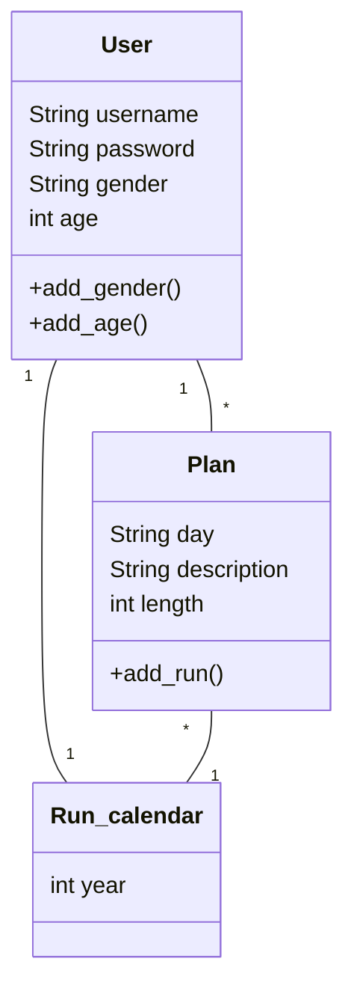

# Arkkitehtuuri

## Rakenne

Koodi on toistaiseksi jaettu pakkauksiin ui (käyttöliittymä), services (sovellus) ja entities (luokat). 
Käyttöliittymä kutsuu sovellusta, joka puolestaan kutsuu luokkia. Tietojen pysyväistallennusratkaisua ei ole vielä toteutetut.

## Luokkakaavio

