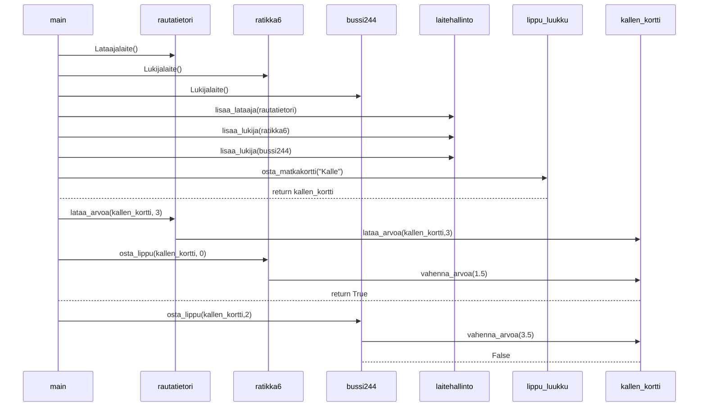

## HSL-kaavio

```mermaid
sequenceDiagram
    main->>rautatietori: Lataajalaite()
    main->>ratikka6: Lukijalaite()
    main->>bussi244: Lukijalaite()
    main->>laitehallinto: lisaa_lataaja(rautatietori)
    main->>laitehallinto: lisaa_lukija(ratikka6)
    main->>laitehallinto: lisaa_lukija(bussi244)
    main->>lippu_luukku: osta_matkakortti("Kalle")
    lippu_luukku-->main: return kallen_kortti
    main->>rautatietori: lataa_arvoa(kallen_kortti, 3)
    rautatietori->>kallen_kortti: lataa_arvoa(kallen_kortti,3)
    main->>ratikka6: osta_lippu(kallen_kortti, 0)
    ratikka6->>kallen_kortti: vahenna_arvoa(1.5)
    kallen_kortti-->main: return True
    main->>bussi244: osta_lippu(kallen_kortti,2)
    bussi244->>kallen_kortti: vahenna_arvoa(3.5)
    kallen_kortti-->bussi244: False
```
