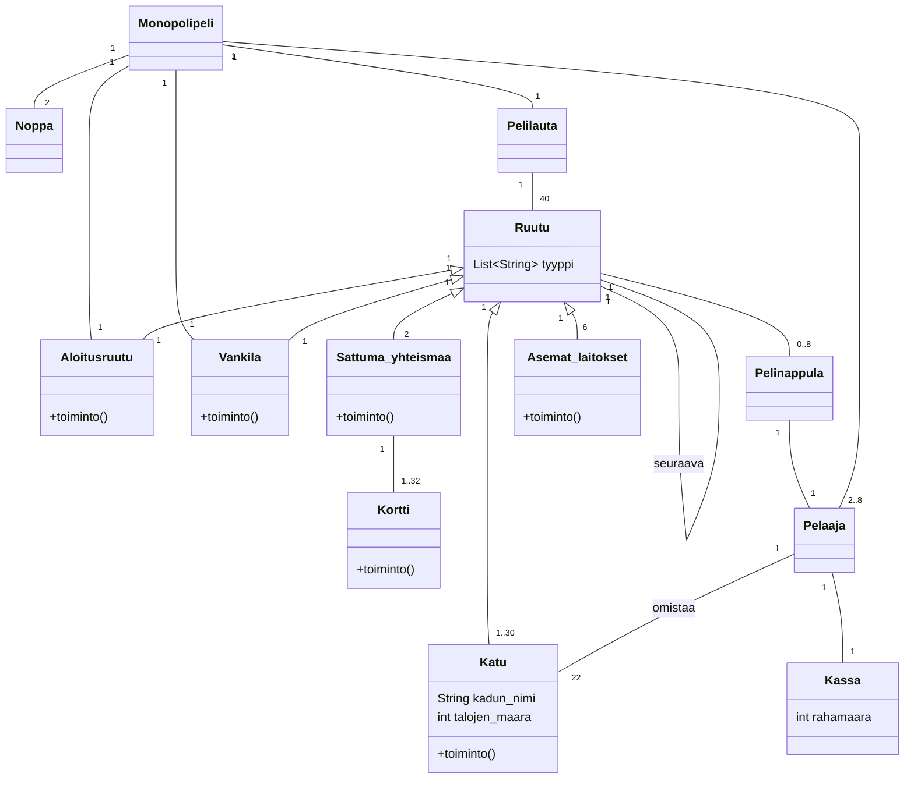

## Jatkokehitetty Monopoli-luokkakaavio

```mermaid
 classDiagram
    Monopolipeli "1" -- "2" Noppa
    Monopolipeli "1" -- "1" Pelilauta
    Monopolipeli "1" -- "1" Aloitusruutu
    Monopolipeli "1" -- "1" Vankila
    Pelilauta "1" -- "40" Ruutu
    Ruutu "1" -- "1" Ruutu: seuraava
    Ruutu "1" -- "0..8" Pelinappula
    Ruutu "1" <|-- "1" Aloitusruutu
    Ruutu "1" <|-- "1" Vankila
    Ruutu "1" <|-- "2" Sattuma_yhteismaa
    Ruutu "1" <|-- "6" Asemat_laitokset
    Ruutu "1" <|-- "1..30" Katu
    Sattuma_yhteismaa "1" -- "1..32" Kortti
    Pelinappula "1" -- "1" Pelaaja
    Pelaaja "1" -- "22" Katu : omistaa
    Pelaaja "2..8" -- "1" Monopolipeli
    Pelaaja "1" -- "1" Kassa

    class Ruutu{
        List~String~ tyyppi
    }
    
    class Aloitusruutu{
        +toiminto()
    }

    class Katu{
        String kadun_nimi
        int talojen_maara
        +toiminto()
    }

    class Vankila{
        +toiminto()
    }

    class Sattuma_yhteismaa{
        +toiminto()
    }

    class Asemat_laitokset{
        +toiminto()
    }

    class Kortti{
        +toiminto()
    }

    class Kassa{
        int rahamaara
    }

```
